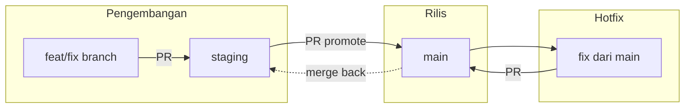

# Pipeline Git: `staging` → `main`

Dokumen ini menjelaskan alur integrasi harian dan promosi rilis. Ringkasan singkat juga ada di [`README.md`](../README.md#git--panduan-branch).

## Setup awal (satu kali per repositori)

Jika branch `staging` belum ada, buat dari `main` dan dorong ke origin:

```sh
git checkout main && git pull origin main
git checkout -b staging
git push -u origin staging
```

Lalu di GitHub: **Settings → General → Default branch** → pilih **`staging`** (disarankan agar PR baru secara default mengarah ke trunk pengembangan).

Branch `staging` harus ada **sebelum** Dependabot memakai `target-branch: staging`; jika tidak, PR otomatis dependency akan gagal dibuat sampai branch tersebut ada.

## Peran branch

| Branch        | Peran                                                                                                                                                                           |
| ------------- | ------------------------------------------------------------------------------------------------------------------------------------------------------------------------------- |
| **`staging`** | **Trunk pengembangan**: semua branch fitur/bug/chore dibuat dari sini dan di-merge lewat PR **ke** `staging`. Targetkan selalu hijau untuk `check`, `lint`, `test` (setara CI). |
| **`main`**    | **Garis rilis / produksi**: hanya bergerak maju lewat **promosi** (`staging` → `main`) atau **hotfix** darurat dari `main`.                                                     |

Pengembangan **tidak** membuat branch dari `main` untuk pekerjaan fitur biasa; basis cabang kerja adalah **`staging`**.

## Alur harian (fitur / bug / chore)

1. Pastikan issue/spec jelas (spec-driven), lalu sinkronkan `staging`:
   ```sh
   git fetch origin
   git checkout staging && git pull origin staging
   ```
2. Buat branch kerja:
   ```sh
   git checkout -b feat/142-ringkasan-singkat
   ```
3. Buka **Pull Request ke `staging`** (bukan ke `main`).
4. Setelah review dan CI hijau, merge ke `staging` (squash disarankan untuk riwayat rapi).
5. Hapus branch fitur setelah merge jika tidak dipakai lagi.

## Promosi ke produksi: `staging` → `main`

Kapan: setelah QA/regresi pada lingkungan yang memakai artefak dari `staging`, atau sesuai jadwal rilis tim.

1. Pastikan `staging` stabil (CI hijau, tidak ada pekerjaan setengah jadi yang tidak boleh ke produksi).
2. Buka **Pull Request dari `staging` ke `main`** (judul misalnya: `release: promote staging to main (YYYY-MM-DD)`).
3. Review singkat diffs gabungan jika perlu; merge (biasanya **merge commit** untuk mempertahankan titik rilis, atau kebijakan tim bisa **squash** sekali).
4. Setelah deploy produksi dari `main`, **sinkronkan kembali** agar hotfix di `main` tidak hilang dari `staging`:
   ```sh
   git fetch origin && git checkout staging && git pull origin staging
   git merge origin/main   # atau: git merge main setelah fetch
   git push origin staging
   ```
   Jika tim memakai pola “staging selalu fast-forward dari main setelah rilis”, sesuaikan; yang penting **isi `main` terkait hotfix kembali ke `staging`**.

## Hotfix produksi (darurat)

Jika produksi (`main`) perlu perbaikan sebelum isi `staging` siap digabung:

1. Cabang dari **`main` terbaru**:
   ```sh
   git fetch origin && git checkout main && git pull origin main
   git checkout -b fix/hotfix-xyz-ringkasan
   ```
2. PR **ke `main`**, merge cepat, deploy.
3. **Gabungkan hotfix ke `staging`** (merge `main` → `staging` atau cherry-pick commit) agar tidak ada regresi di rilis berikutnya.

## Ringkasan alur



## CI dan otomatisasi

- Workflow GitHub Actions di `.github/workflows/ci.yml` menjalankan verifikasi pada **push/PR** ke `staging` dan `main`.
- Dependabot dikonfigurasi membuka PR dependency ke **`staging`** (`target-branch` di `dependabot.yml`) agar bump masuk jalur integrasi dulu.

## Pengaturan repo GitHub yang disarankan

- **Default branch** untuk PR baru: **`staging`** (agar kontributor tidak salah memilih `main` sebagai basis).
- **Branch protection** pada `staging` dan `main`: wajib PR, wajib status CI, optional review.
- **Restrict who can push** ke `main` jika hanya lead/release manager yang boleh merge promosi.
